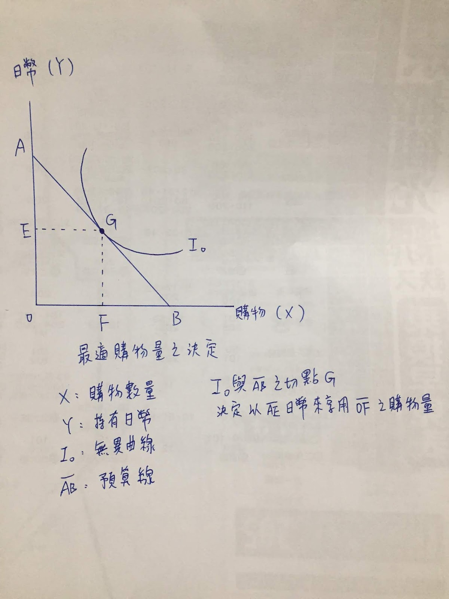

# 愛shopping買買買！！！

出國自由行一定要大大的shopping一下啊，在這又要大推一下自助旅遊了，可以逛到你想逛的店，可以逛到當地道地的店，參加旅行團(購物團？)，帶你去的都是大賣場一樣毫無特色可言，而且更多的根本就是本國人經營的賣場嘛。

> 那麼shopping花多少錢才對呢？

首先你有一條成本線，這趟旅程總可以用在購物上金額，線的高低取決你，應該很少很少人可以無上限花錢吧。

接著依照每個人購物偏好的不同，人人都畫上一條購物無異曲線，指的是你買了多少東西與剩下的錢比例，同一線上的滿足感會相同，購物偏好者：他的線會往購物數量偏往右下跑。
購物厭惡者：他傾向保留手上的錢，而使曲線在左側。

成本線與這條無異曲線相交一點，這一點對照出最適合的的shopping量以及殘餘現金，換句話說，就是在有限的成本內所能達到購物的最大滿足感，出國(當然是日本)旅遊該花多少該買多少，
出國前就可以依照個人特質衡量衡量，每個人都該畫出自己的購物無異曲線與成本線，出國玩嘛，當然要玩出最大經濟效應。
