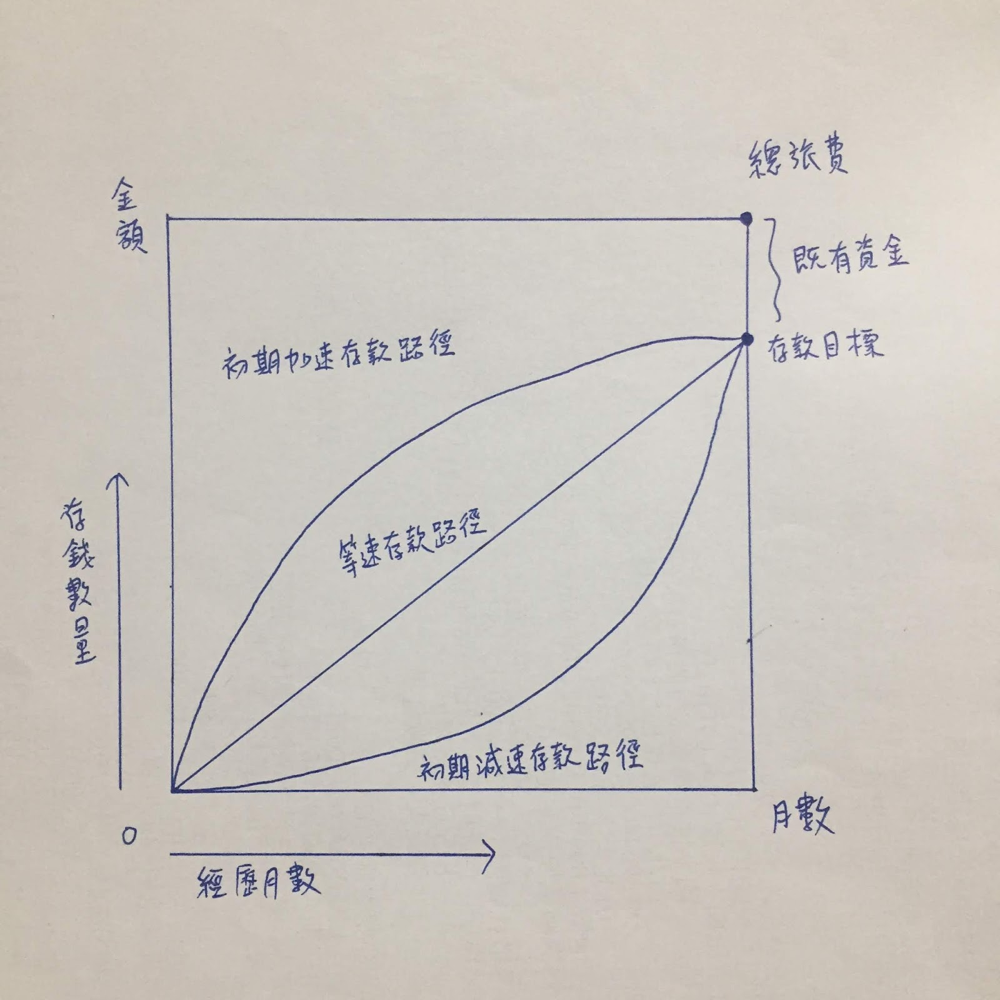
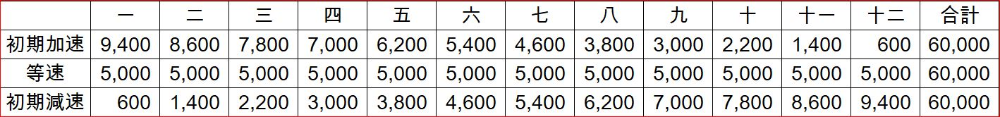

# 想存錢去旅行！別傻了，你永遠也去不了！

存錢去旅遊?這聽起來相當的勵志，但想想更容易變成一個偽命題，沒有錢就不要去嘛！但是現代人喜歡雞湯，既然喜歡這種虛情假意又沒幫助的溫情，就熬上一鍋大雞湯給你們補一補。以下就來介紹幾個有關存錢的經濟模型：

## 1.初期加速存款：剛開始存很多，慢慢遞減，先苦後甘型。
## 2.等速存款：定期定額，中庸型。
## 3.初期減速存款：一開始存小錢，接著越來越多，先甘後苦。

計算的方法是：首先，當然是預估你的總旅費要多少，接著扣掉你已經有可以來花的錢，之後的缺口就是還要花時間存的數字囉，這套存錢法分了三條路可以走，不管哪一條都可以到達你旅遊的目標，重點在於堅持地走下去，先前之所以說存錢旅遊是個偽命題呢，是因為中途的變數實在太多了，你能不能走到是個大問題，而能夠堅持的人自控性較強，人生中往往也早已經有足夠的金錢來旅行，何必刻意存錢。

有人說圖型看不懂不知道什麼是加速什麼是減速，那我們來看實際案例好了，如下表所示，假設總旅費需要10萬，你手上已經有了4萬，那要存的就是6萬，給你12個月時間來攢錢，攢錢3條路每個月應該存下的金額如下：

這樣是不是一目了然，每個月要拿這麼多錢出來存，多可怕！當然關於存錢你還可以發明出來什麼五花八門型、天花亂墜型，365天型，都不再討論了，畢竟堅持比較重要，對存錢旅遊這個難題，訂了一堆計畫，最後做不到還是白搭！存錢→旅遊 ，這條路太難走了，我們還是換一條路：

> 有錢→旅遊。
