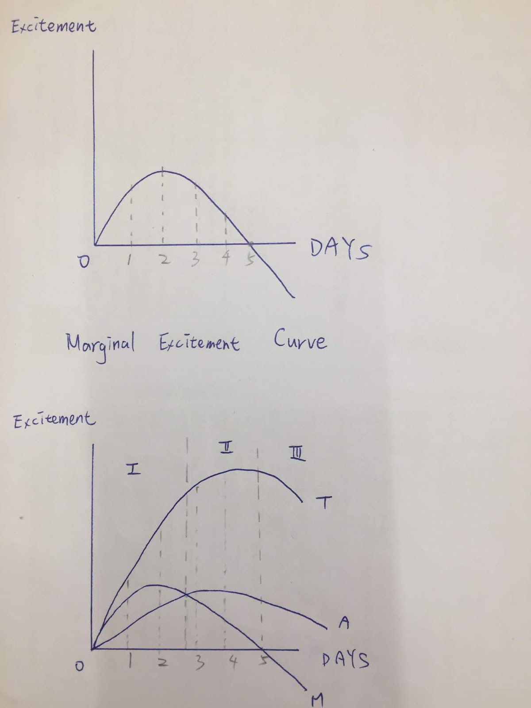

# 學了邊際效應後赫然驚呆，出國玩好玩滿7天實在是種糟糕又蠢笨的行為.........

## 邊際效應
指的是我們消費者在逐次增加1個單位消費品的時候，帶來的單位效用是逐漸遞減的，這樣講經濟學上的小白們懂嗎？

For example 舉個例子：
* 吃一顆蘋果→好好吃
* 吃第二顆蘋果→還不錯吃耶
* 吃第三顆蘋果→有點撐了啦，吃不太下
* 吃第四顆蘋果→肚子好飽喔，想吐
* 吃第五顆蘋果→去廁所了
* 吃第六顆蘋果→...............................

很簡單的道理，就像是什麼"貪多嚼不爛"，或者是"less is more "，這都是可以另外衍伸的變異體，而這種可怕的事情當然也可以運用在旅遊上。

如以上精美的圖例所示，你在旅行的過程中，能夠體驗的high度會隨著天數逐漸下降，到了一定程度之後，甚至會產生了負面效果，一個好好的旅程，怎麼會如此不堪呢？

For example again 再次舉個例子：
拿京都旅遊來說 (人人都該去京都，不只一次！)
* 第一天帶你看了清水寺，你說："哇！好棒！"
* 第二天帶你看了金閣寺，你說："哇！跟旅遊書上一樣耶！好棒！"
* 第三天帶你去銀閣寺，你說："........不要再看廟了啦......我要回家！"

給你連著七天寺廟行程就是黏膩，當然你可以穿插著其他風景、美食、購物等等，你可以玩了7天還不過癮繼續玩，但是給你玩個70個7天呢，不知道要去哪裡了吧，好無聊！所以我們總是說旅行就是從自己活膩的地方到別人活膩的地方去，一但玩到膩了的心理狀態產生，當下最理性的抉擇就是回家吧！

因此啊，每次出遊之前要先做好評量測驗，預估出你的邊際天數在哪裡，適合長遊還是短行，另外也可以用其他方法來提升旅遊high度，這樣可以造成邊際遞減延緩，讓你玩得更多天一點，學習一點點經濟學對快快樂樂的旅遊是蠻有幫助的，至少這一次我們破了膩這個局，人生坑坑洞洞，局太多了，只能不斷尋找破局的方法。

以上 over 。
