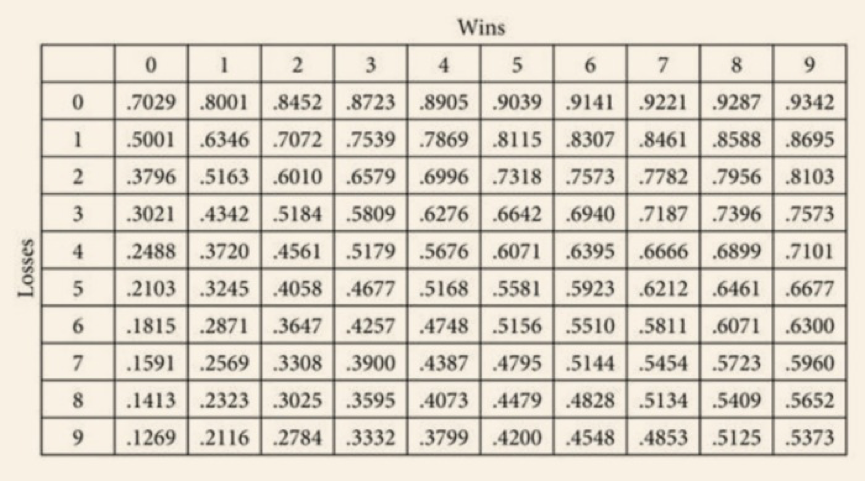

# 基廷斯式的旅遊

## 基廷斯指數

這是我新學到的一個概念，用數值來解決選擇問題，下面是基廷斯算出的指數表，一切的抉擇基本可以利用這個表找到答案，至於他是怎麼求得的就不知道了，現階段會用，用得上就好。

* 旅遊地點：京都vs.東京vs.未知國度

  先從我的11次旅程舉例子做簡單運算，必須狠下心區分旅程好壞才能比較，京都去了8次(5好3壞：0.6642)、東京3次(2好1壞：0.7072)，而尚未去的國度是(0好0壞：0.7029)。
  
  這樣子一看東京(0.7072)>未知國度(0.7029)>京都(0.6642)，表示我的下一次旅程應該先選擇去東京，或者可以探索一個新國家，至於京都則是因為去過太多次，終會趨近於不好不壞，這個方法就是這麼簡單粗暴，這是純數學模型下的決策方法，現實中仍然會受到其他許多因素影響，充其量做個參考吧。
  
* 「時間」因素

  基廷斯另外還提了「時間」的影響力，越是時日無多，下一次選擇的貶值率也就大，對應在旅行上可以說是如果旅程時間不多，就考慮那些已經去過穩穩妥妥的地方，雖然嘗鮮可以獲得意料中的驚喜，但往往也會伴隨著地雷，如果去個十天半個月，踩到一兩個雷還能夠接受，如果是兩天一夜的旅行，能夠好好吃上一頓的也只有一兩餐時間，還踩到地雷餐廳豈不是太過於不幸了。
